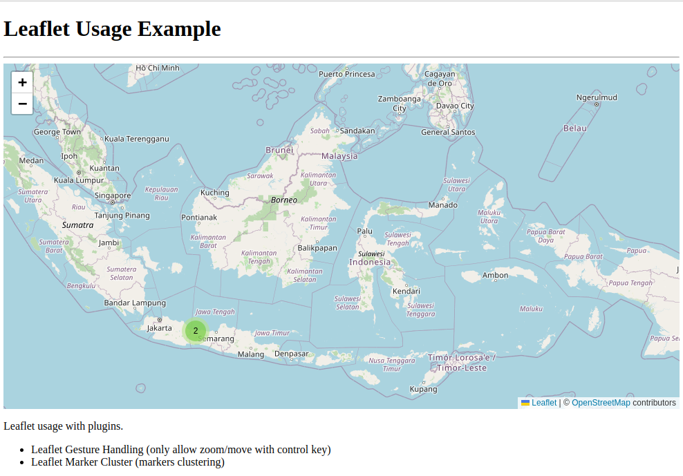
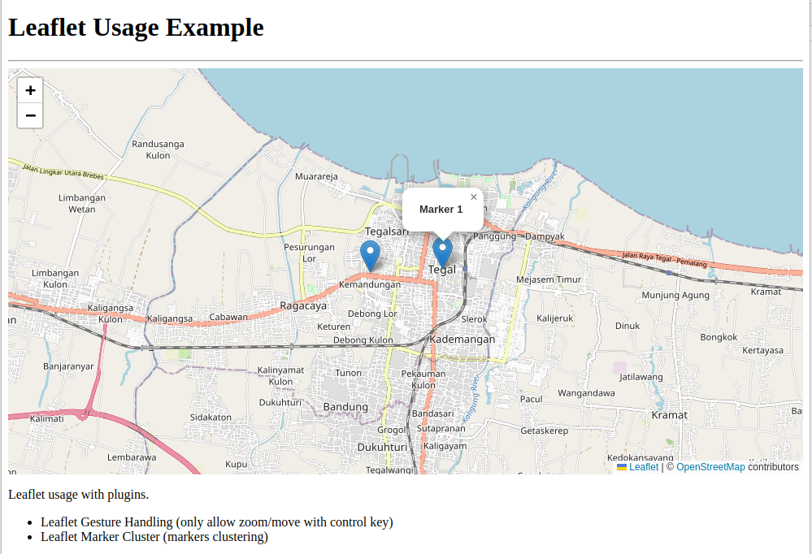
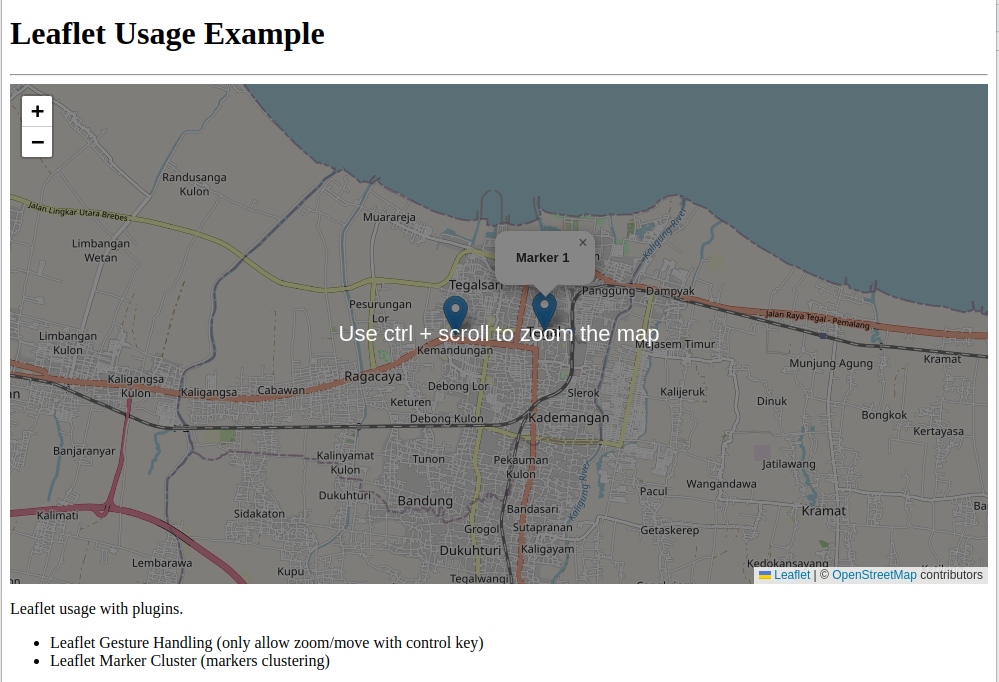

# LeafletJs Usage

Usage of [LeafletJs](https://leafletjs.com/) with some plugins.

## Plugins applied

- [Leaflet Gesture Handling](https://github.com/elmarquis/Leaflet.GestureHandling)
  only allow zoom/move with control key
- [Leaflet Marker Cluster](https://github.com/Leaflet/Leaflet.markercluster)
  markers clustering

## Screenshots

- Marker clustering
  
- Marker clustering after click
  
- Gesture handling on scrolling
  